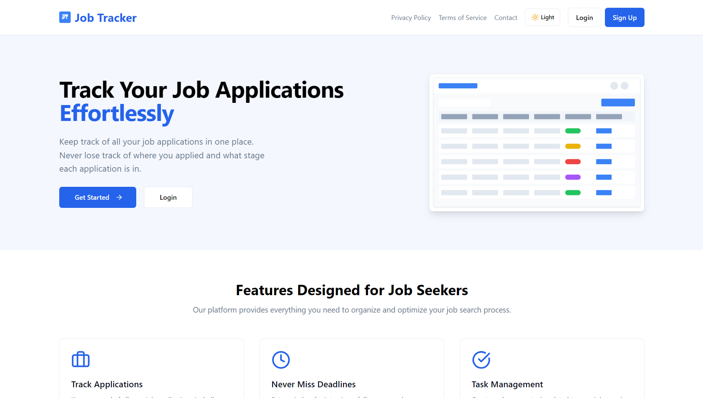
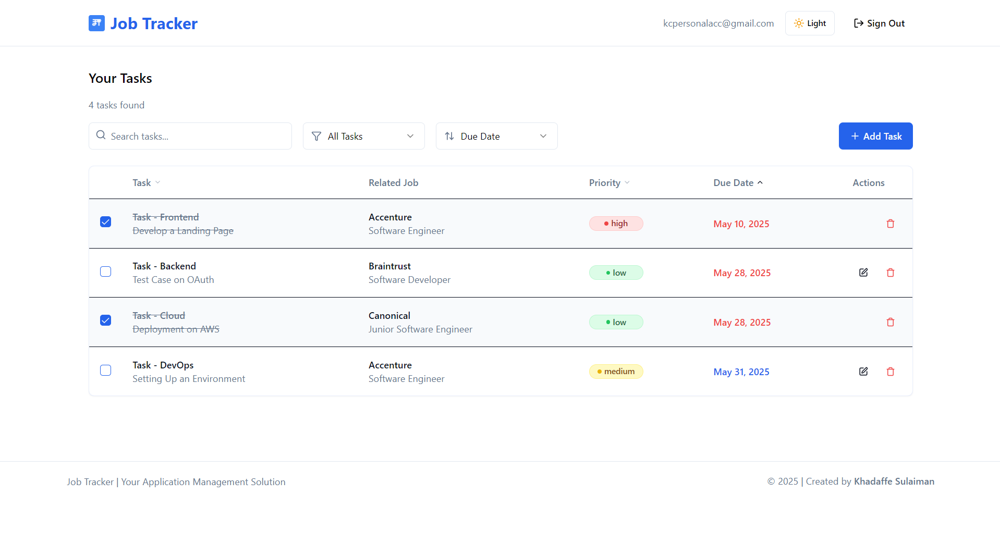

# Job Tracker Application

A modern web application built with React, TypeScript, and Supabase to help users manage their job search journey. Users can track job applications, manage related tasks, and view insightful analytics to optimize their job search strategy.

## Screenshot Preview

<p align="center"> <strong> Job Tracker Application </strong></p>




| Tracking Jobs | Manage Tasks|
|:-------------------------:|:-------------------:|
|  |  |

## Features

- **Authentication**
  - Sign up, log in, and log out functionality using Supabase Auth
  - Protected routes to ensure only authenticated users can access their data

- **Job Application Management**
  - Create, read, update, and delete job applications
  - Track essential job information (company, role, date applied, location, link, status)
  - Sort and filter job applications

- **Task Management**
  - Create and manage job search-related tasks with due dates
  - Track task status (pending, completed)
  - Filter tasks by status, due date, and more
  - Get alerts for overdue tasks

- **Analytics Dashboard**
  - Visual representation of application status distribution
  - Job search insights and trends
  - Response rate tracking
  - Average response time metrics

- **Modern UI**
  - Sleek, responsive interface built with Tailwind CSS and shadcn/ui components
  - Dark/light theme toggle
  - Modal forms and popovers for interactive content
  - Status indicators with color coding
  - Beautiful and accessible UI components

## Tech Stack

- **Frontend**: React + TypeScript
- **Backend/Auth**: Supabase (Auth and Postgres database)
- **Styling**: Tailwind CSS + shadcn/ui (built on Radix UI)
- **Additional Libraries**: React Router DOM, React Hook Form, Lucide React (icons)

## Setup Instructions

### Prerequisites

- Node.js and npm
- Supabase account with a new project

### Installation

1. Clone the repository
2. Install dependencies:
   ```
   npm install
   ```
3. Create a `.env` file in the root directory with your Supabase credentials:
   ```
   REACT_APP_SUPABASE_URL=your_supabase_url
   REACT_APP_SUPABASE_ANON_KEY=your_supabase_anon_key
   ```

### Supabase Setup

1. Create a new Supabase project
2. Enable Email authentication in the Authentication settings
3. Create a new table called `jobs` with the following columns:
   - `id`: uuid (primary key)
   - `user_id`: uuid (foreign key to auth.users)
   - `company`: text
   - `role`: text
   - `date_applied`: date
   - `location`: text
   - `link`: text
   - `status`: text
   - `created_at`: timestamp
4. Set up Row Level Security (RLS) policies to ensure users can only access their own data

### Running the Application

```
npm start
```

The application will be available at http://localhost:3000

## Development

### Available Scripts

- `npm start`: Run the app in development mode
- `npm test`: Launch the test runner
- `npm run build`: Build the app for production